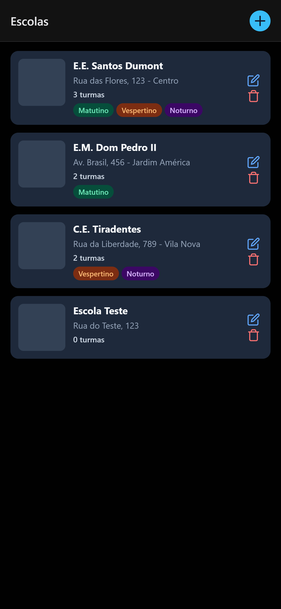
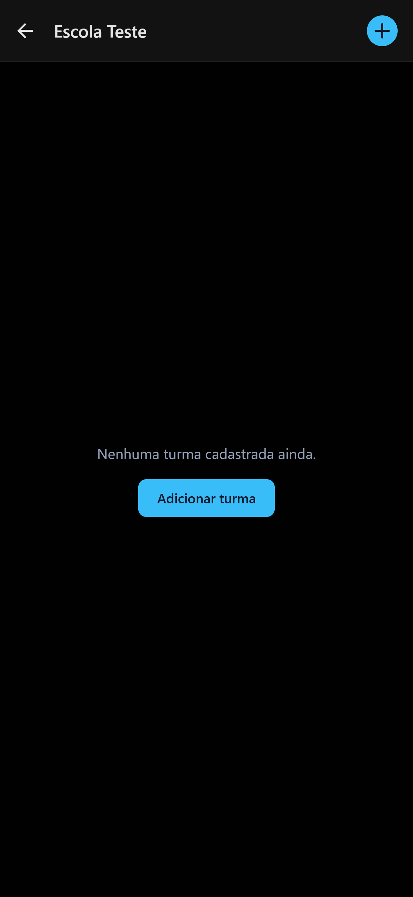
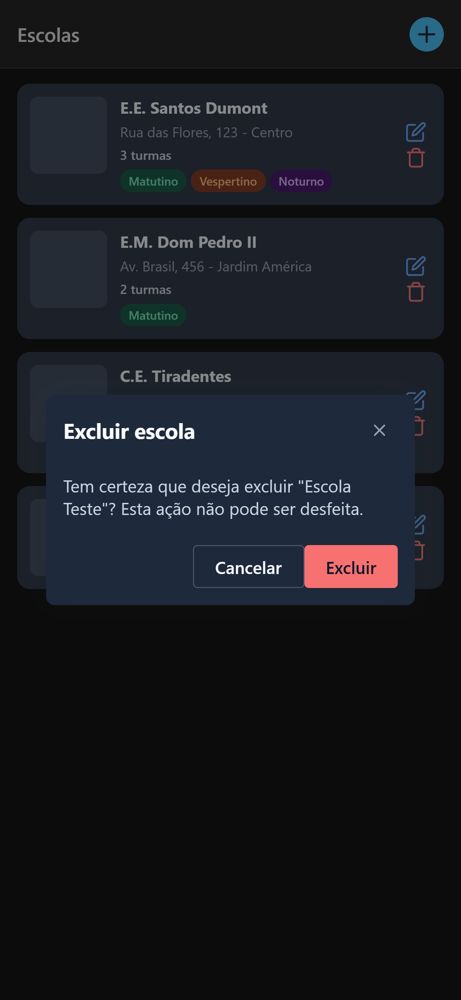

# School Manager — Desafio Técnico React Native

Aplicativo móvel multiplataforma (Android/iOS) para centralizar o cadastro de escolas públicas e suas turmas, substituindo o controle manual em planilhas.

---

## Screenshots

| Lista de Escolas | Lista de Turmas | Formulário de Escola | Formulário de Turma | Estado Vazio | Confirmação de Exclusão |
|:---:|:---:|:---:|:---:|:---:|:---:|
|  |  |  |  |  |  |

---

## Funcionalidades

### Módulo de Escolas
- Listar escolas com nome, endereço, número de turmas e turnos
- Adicionar nova escola (nome e endereço obrigatórios)
- Editar e excluir escola com confirmação de deleção

### Módulo de Turmas
- Listar turmas vinculadas à escola selecionada
- Cadastrar nova turma (nome, turno e ano letivo obrigatórios)
- Editar e excluir turma com confirmação de deleção

### Estados de interface
- **Loading** — indicador de carregamento em todas as telas
- **Erro** — mensagem de erro com botão de nova tentativa
- **Vazio** — estado amigável com call-to-action quando não há dados
- **Feedback** — toast após cada mutação (criar, editar, excluir)

---

## Stack e Versões

| Tecnologia | Versão | Papel |
|---|---|---|
| Node.js | 18+ | Runtime |
| Expo | ~54.0 | SDK e toolchain |
| React Native | 0.81.5 | Framework mobile |
| React | 19.1.0 | Runtime de UI |
| TypeScript | ~5.9 | Tipagem estrita |
| Expo Router | ~6.0 | Navegação file-based |
| Gluestack UI | ^1.1.73 | Biblioteca de componentes |
| MirageJS | ^0.1.48 | Mock de back-end em memória |
| Context API | — | Gerenciamento de estado global |
| Jest | ^29.7 | Testes unitários |
| Testing Library RN | ^13.3 | Testes de componentes |

---

## Instalação e Execução

### Pré-requisitos

- Node.js 18 ou superior
- npm 9 ou superior
- App **Expo Go** no celular, ou simulador Android/iOS configurado

### Instalar dependências

```bash
npm install
```

### Rodar o projeto

```bash
npx expo start
```

Escaneie o QR Code com o Expo Go, ou pressione:
- `a` → emulador Android
- `i` → simulador iOS

---

## Mock de Back-end (MirageJS)

O mock é inicializado **automaticamente** em modo de desenvolvimento (`__DEV__ === true`). Nenhuma configuração adicional é necessária — o MirageJS intercepta todas as chamadas `fetch` e responde com dados em memória.

### Endpoints simulados

| Método | Endpoint | Descrição |
|---|---|---|
| GET | `/schools` | Lista todas as escolas (com `classCount` e `shifts` derivados) |
| POST | `/schools` | Cria uma escola |
| PUT | `/schools/:id` | Atualiza uma escola |
| DELETE | `/schools/:id` | Remove uma escola |
| GET | `/classes?schoolId=:id` | Lista turmas de uma escola |
| POST | `/classes` | Cria uma turma |
| PUT | `/classes/:id` | Atualiza uma turma |
| DELETE | `/classes/:id` | Remove uma turma |

O servidor já vem com **3 escolas** e **7 turmas** pré-cadastradas como seed data.

---

## Testes

```bash
npm test
```

Cobertura de testes com Jest + Testing Library React Native:

- Componentes: `SchoolCard`, `SchoolForm`, `SchoolList`, `ClassCard`, `ClassForm`, `ClassList`
- Componentes compartilhados: `EmptyState`, `ConfirmDialog`
- Hooks: `useSchools`, `useSchoolActions`, `useClasses`, `useClassActions`

---

## Arquitetura

Estrutura feature-based. As telas são finas — toda a lógica vive em hooks.

```
app/
  _layout.tsx          ← Stack navigator raiz + providers
  index.tsx            ← redireciona para /schools
  schools/
    index.tsx          ← tela de lista de escolas
    [id].tsx           ← tela de detalhe da escola + turmas

src/
  components/          ← compartilhados: EmptyState, ConfirmDialog
  features/
    schools/
      components/      ← SchoolCard, SchoolForm, SchoolList, ShiftBadge
      hooks/           ← useSchools (fetch), useSchoolActions (mutações + toast)
      context/         ← SchoolsContext
      types.ts
    classes/
      components/      ← ClassCard, ClassForm, ClassList
      hooks/           ← useClasses, useClassActions
      context/         ← ClassesContext
      types.ts
  mocks/
    server.ts          ← MirageJS: rotas + seed data
  services/
    api.ts             ← wrapper de fetch (get / post / put / delete)
  test-utils/
    index.tsx          ← customRender + AllProviders
```

### Padrões aplicados

| Padrão | Onde |
|---|---|
| Context stores dados brutos, sem chamadas de API | `*Context.tsx` |
| Hooks controlam fetch e sincronização de estado | `useSchools`, `useClasses` |
| Hooks controlam mutações + toast | `useSchoolActions`, `useClassActions` |
| Telas controlam apenas estado local de UI | `app/schools/*.tsx` |
| Delete sempre passa por `ConfirmDialog` | `ConfirmDialog.tsx` |
| Adapter de fetch centralizado | `src/services/api.ts` |
